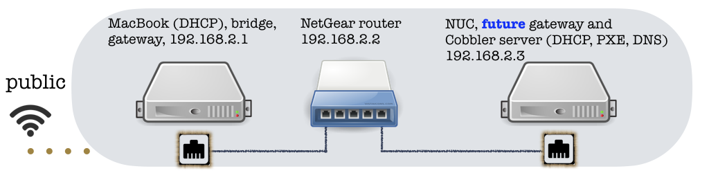

Connecting MacBook, switch and NUC gateway
==========================================

## Step 1 of [Automating private bare-metal cluster setup with Cobbler](README.md)

By [Alexey Siretskiy](https://www.linkedin.com/in/alexey-siretskiy-254992a7/)


We will start our setup by connecting switch to the MacBook in order to  figure out switch's IP address, so  we able to configure it.
After configuring the switch we will attach a  NUC to it. That NUC  will be used later as  a gateway (GW) to provision the rest of cluster nodes.

### Getting access to the switch's Web-interface.


On the MacOS the easiest way to proceed is to enable Internet Sharing via the Ethernet cable.


Just plug in the Ethernet cable from MacBook to the switch to any port.
The factory default settings make all ports accessible for any connection.
Just to make it definite, lets use port 8, the last port for the selected model.

Under the hood the MacOS will create a network bridge and subnet (here `192.168.2.0`), assign the  `192.168.2.1` to the MacBook gateway (not NUC)  and provide DHCP-assigned IPs to the devices attached to the Ethernet cable, e.g. to the switch.

Now lets open the `Terminal` on the MacBook and scan the `192.168.2.0` net:


```bash
❯ nmap "192.168.2.*"                                                                       [13:28:52]

Starting Nmap 7.40 ( https://nmap.org ) at 2017-05-08 13:28 CEST
Nmap scan report for 192.168.2.1
Host is up (0.00015s latency).
Not shown: 998 closed ports
PORT   STATE SERVICE
22/tcp open  ssh
53/tcp open  domain

Nmap scan report for 192.168.2.2
Host is up (0.066s latency).
Not shown: 998 closed ports
PORT     STATE SERVICE
80/tcp   open  http
4242/tcp open  vrml-multi-use
```

The `192.168.2.1` is the IP of the MacBook in the `192.168.2.0` network, and the
 IP assigned to the switch is `192.168.2.2`. Pointing  `Safari` to `192.168.2.2:80` one can login to the Web interface with the `password` and set it up.


There are plenty of settings. The most important for us are those for VLAN and for  IP.
Let's leave the settings for a while as they are.


[comment]: <> (Go to `Switching->VLAN->Advanced->VLAN membership`. There are three already preconfigured VLANs, 1, 2 and 3. Lets keep them.
For the VLAN 1, choose `Port` to see the `U` for all ports from 1 to 8. It
means, that all ports are attached to the VLAN 1, and configured as **untagged**.)
### Connecting a NUC

Now  attach a NUC (with already installed OS, keyboard and screen) to the port 1 and turn the NUC on.

**[Here we assume that there are no any special network settings are applied to the NUC. If there are, consider to log in into it and reset the  network to defaults -- no VLANs, no firewall (`sudo systemctl stop firewalld`).]**

Now let's scan the `192.168.2.0` from the OSx:

    ❯ nmap "192.168.2.*"                                                                       [13:28:52]

    Starting Nmap 7.40 ( https://nmap.org ) at 2017-05-08 13:28 CEST
    Nmap scan report for 192.168.2.1
    Host is up (0.00015s latency).
    Not shown: 998 closed ports
    PORT   STATE SERVICE
    22/tcp open  ssh
    53/tcp open  domain

    Nmap scan report for 192.168.2.2
    Host is up (0.066s latency).
    Not shown: 998 closed ports
    PORT     STATE SERVICE
    80/tcp   open  http
    4242/tcp open  vrml-multi-use

    Nmap scan report for 192.168.2.3
    Host is up (0.00051s latency).
    Not shown: 999 closed ports
    PORT   STATE SERVICE
    22/tcp open  ssh

    Nmap done: 256 IP addresses (3 hosts up) scanned in 8.72 seconds

Now we can `ssh xadmin@192.168.2.3`, where `xadmin` is the already existing user on NUC,  and check the Internet connection is working  as `ping google.com`.

We have now  Internet-enabled network of 3 nodes, one of which is a OSx router (`192.168.2.1`), and the another one is the NUC (`192.168.2.3)`, which we will set up and configure as a GW for the whole cluster.



TIP
---

Try to play and exclude a port from the VLAN1 by pressing on it's icon until it shows empty image, and attach the NUC to that port and try to re-scan the subnet.
