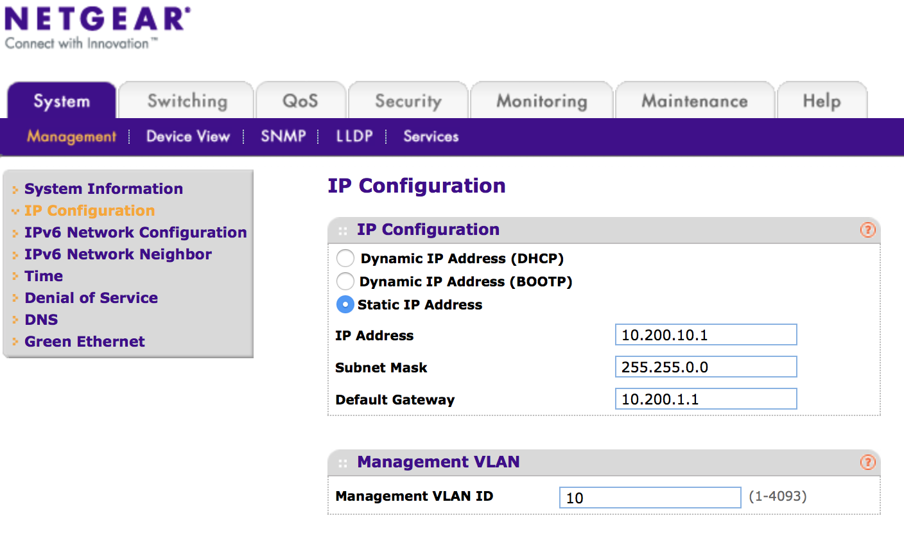
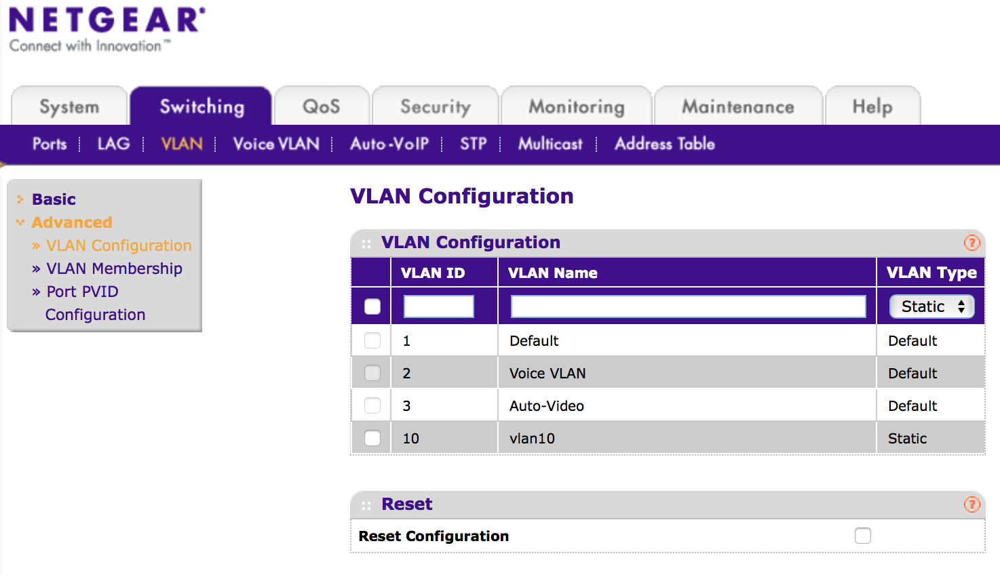
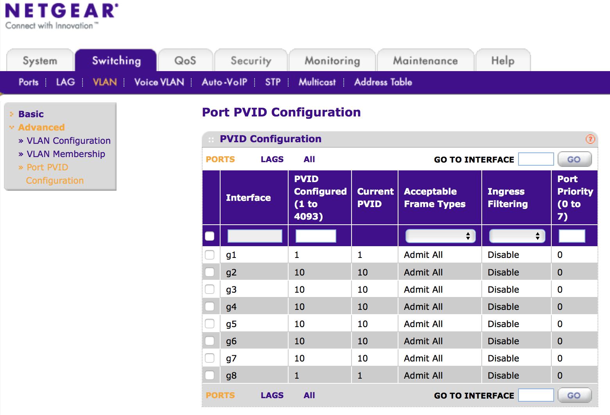

Hiding switch behind the firewall
================================

## Step 5 of [Automating private bare-metal cluster setup with Cobbler](README.md)

By [Alexey Siretskiy](https://www.linkedin.com/in/alexey-siretskiy-254992a7/)

So far the setup looks nice -- we are able to PXE install and provision NUCS in  automatic manner. The whole cluster has Internet access via Macbook (for a moment).

What could be done in order to increase security -- is to move the switch behind the firewall *i.e.* behind the  NUC GW, so the only part of the cluster visible outside -- is the "external_IP" of the gateway.

Commonly used practice in the enterprises is to create a special "manage" VLAN, which is solely used for configuring switches. In our case for a single cluster it is enough to join switch to the same VLAN, which is being used to interconnect internal nodes -- the `vlan2`, *i.e.* assigning the *internal* IP to the switch.

 The IPs for the internal nodes are leased by the `dnsmasq` server, running on the NUC gateway. The IP of the switch should be on the same network, behind the firewall, but it should by *statically* assigned, so we always know how to access it.

 In order to avoid IP collisions with the IPs of the worker NUCs, one could do the following. Change the IP addresses  in `vlan2` from `10.200.1.1/24` to `10.200.1.1/16` and put the `10.200.10.1` as the switch's *stastic* IP. By doing so, the `10.200.10.1` will still be on the same subnet, `10.200.0.0`, but it's IP is out of range of the IPs assigned by the `dnsmasq` (`10.200.1.100-10.200.1.199`), so no IP collisions.

The final thing to consider is to move the `vlan2` to *e.g* `vlan10`, since the `vlan2` on the given switch could not be set up as a *manage* VLAN:

1. create on the NUC gateway new `vlan10`, assign IP, and delete the `vlan2`
     1.  `[root@c2gw xadmin]# ip link add link eno1 name vlan10 type vlan  id 10`
    1. `[root@c2gw xadmin]# ip link set vlan10 up`
    1. `[root@c2gw xadmin]# ip addr add 10.200.1.1/16 brd 10.200.255.255 dev vlan10`
    1. `[root@c2gw xadmin]# ip link del vlan2`
1. login to switch `192.168.2.2`,
    1. create `vlan10` there and  assign ports 2-7 to it
    1. set the default VLAN `PVID` for ports 2-7 to `vlan10`
    1. set *static* IP as `10.200.10.1` with mask `255.255.0.0` and default gateway as `10.200.1.1`
    1. set `Management VLAN ID`  (om the same page) to 10 and, finally, apply changes

After that is done, you will loose connectivity to switch via `192.168.2.2`. Instead one should go to the NUC gateway and point browser to `10.200.10.1`.

The only step left is to remove the MacBook and connect the external Ethernet cable to the port 8, and plugout-plugin the Ethernet cable from port 1, so the DHCP from the external network will assign the IP to the NUC gateway for VLAN1.
After that is done, the setup should look like as in the lower part of the Figure.

