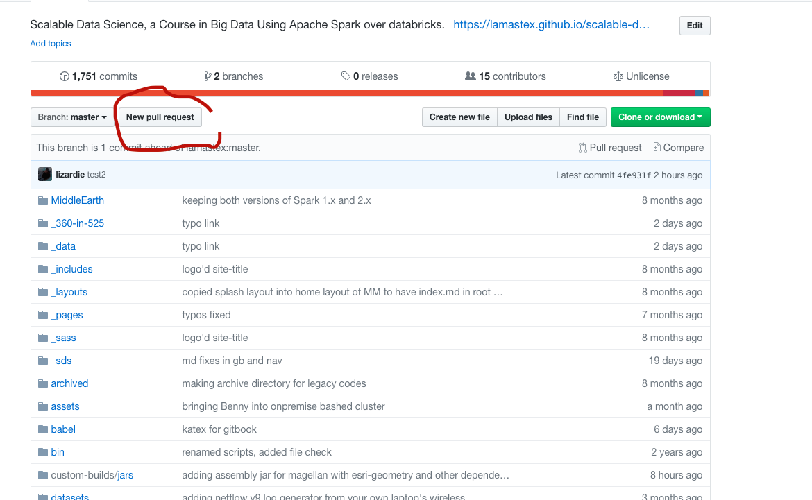

## Do Steps 1.,2., and 3. only once in a laptop or machine but Step 4. each time you want to update with lamastex master and make a pull request

### 1. With a browser go to lamastex github repository of interest or `repoName`:

 - https://github.com/lamastex/repoName

For example `repoName` could be one of:

- `scalable-data-science`
- `mrs2`
- etc.

### 2. Hit the `Fork` button (you are logged in with your github user-name called `YOURUSERNAME` in github now)

### 3. Make a local copy of your fork of repoName from lamastex
 
```
$ mkdir repoName
$ cd repoName
$ git init
$ git remote add -f origin https://github.com/YOURUSERNAME/repoName.git
```

## 4. Do the following every time you want to be up to date with lamastex repoName and make some changes and finally to make a pull request to lamastex/repoName master

```
$ pwd
```
> repoName

```
$ git checkout master
$ git pull https://github.com/lamastex/repoName.git master
```
#### If there are conflicts, resolve them. For more information, see "Addressing merge conflicts".

#### Now you are up yo date with the master

### Commit the merge.

```
$ git status
$ echo "lala" > testA.txt
$ git commit -a -m "testing adding a file"
```

#### Review the changes and ensure they are satisfactory.
### Push the merge to USERNAME's (your) GitHub repository.

```
git push origin master
```

### Finally go to the github URL of your repos in a browser

- https://github.com/YOURUSERNAME/repoName

And use the GUI to make a "Pull Request" **akin** to the display below:



## I will merge your Pull Request when I can and thanks.

Raaz

Wed Apr  4 18:02:28 CEST 2018
