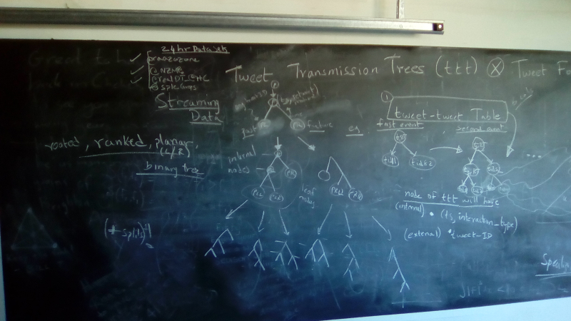
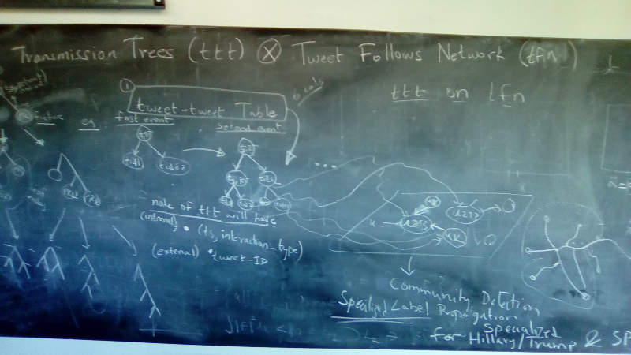
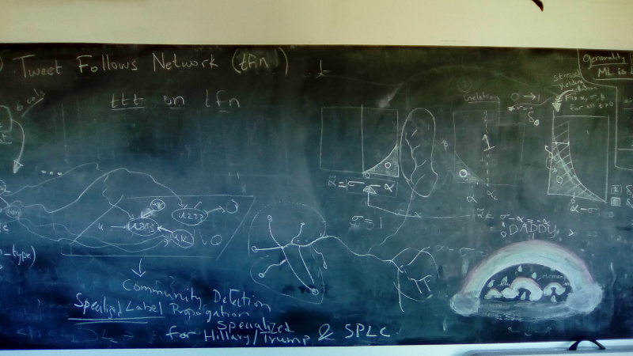

# Project MEP: Meme Evolution Programme / research

This is the public research/learning/teaching repository for [Project MEP: Meme Evolution Programme](https://lamastex.github.io/scalable-data-science/sds/research/mep/).

This programme is partly supported by:

* databricks academic partners program (for distributed cloud computing) 
	* through https://academics.cloud.databricks.com
* Research Chair in Mathematical Models of Biodiversity (for mathematical theorizing) held jointly by:
	* [Veolia Environnement](http://en.wikipedia.org/wiki/Veolia_Environnement), 
	* [French National Museum of Natural History](http://www.mnhn.fr/fr), Paris, France and 
	* [Centre for Mathematics and its Applications, Ecole Polytechnique](http://www.cmap.polytechnique.fr/), Palaiseau, France.

Raazesh Sainudiin
[Laboratory for Mathematical Statistical Experiments](http://lamastex.org)

## LICENSE

Copyright 2016 Raazesh Sainudiin 

Licensed under the Apache License, Version 2.0 (the "License");
you may not use this file except in compliance with the License.
You may obtain a copy of the License at

    http://www.apache.org/licenses/LICENSE-2.0

Unless required by applicable law or agreed to in writing, software
distributed under the License is distributed on an "AS IS" BASIS,
WITHOUT WARRANTIES OR CONDITIONS OF ANY KIND, either express or implied.
See the License for the specific language governing permissions and
limitations under the License.

## Tweet Transmission Tree

This is the job to get the 'interconnected set of tweets' from the streaming jobs already done. This can be formalized as **ttt := tweet transmission tree** depending on what is extractable from it.

### Blackboard discussion notes at LaMaStEx on 2016-10-10. 
We will eventually lua/la/ka-tex mathematically here..

#### Tweet Transmission Trees (ttt) and Tweet Follows Network (tfn)

### Tweet Transmission Tree (TTT)

#### Collecting tweets

* extended TwitterUtils for *tweet collection*:
	* tracking arbitrary list of strings and 
	* following arbitrary list of twitter-userIDs 
	* see databrick notebook: [http://lamastex.org/lmse/mep/src/extendedTwitterUtils.html](http://lamastex.org/lmse/mep/src/extendedTwitterUtils.html) 

#### Producing TTTs

* producting Tweet Transmission Trees (TTTs) from the collected tweets, including: 
	* categorization of tweet-types
	* getting retweet-transmission trees for downstream nonparametric model estimation and prediction, eg. Hawkes Process models
	* etc, etc...
	* see databricks notebook: [http://lamastex.org/lmse/mep/src/TweetAnatomyAndTransmissionTree.html](http://lamastex.org/lmse/mep/src/TweetAnatomyAndTransmissionTree.html)

#### Twitter Health Metrics Proposal "Scalable Markov Kernels from Twitterverse to GDELT Project"

Read it [here](proposals/twitterHealthMetrics/proposal.md) in more detail.

#### To Be Released Soon

* single-source shortest weighted path-ways as distributed vertex programs
	* Aldous' 'directed' meeting process as Geomertic Random Variables on each directed edge between a pair of twitter-ID-nodes that is obtained from a Poisson with random mean drawn from Exponential Random Variables with rate given by the inverse of the observed number of 'meeting' events
	* adaptation of the above to multiple sources for 'multi-extremal' ideological concurrence profiles
        * with iterative k-means clustering for a de-contracting hierarchy of Nearest Neighbor-joining trees/forests (Joakim Johansson's MSc theses Uppsala 2018)

* interactive and iterative populations-of-interest selective breadth-first network expansion designs for updating live stream filters
	* interctive D3 plots by Olof Bjorck, Uppsala University Spring 2018.

#### Theory under Progress
* theory being "tango-ed" with data in:
	* [private github repos](https://github.com/raazesh-sainudiin/working-manuscript-MEPCMAPX)
* see [Published and Working papers of Project MEP: Meme Evolution Programme](https://lamastex.github.io/scalable-data-science/sds/research/mep/#published-and-working-papers-of-projet-mep)

