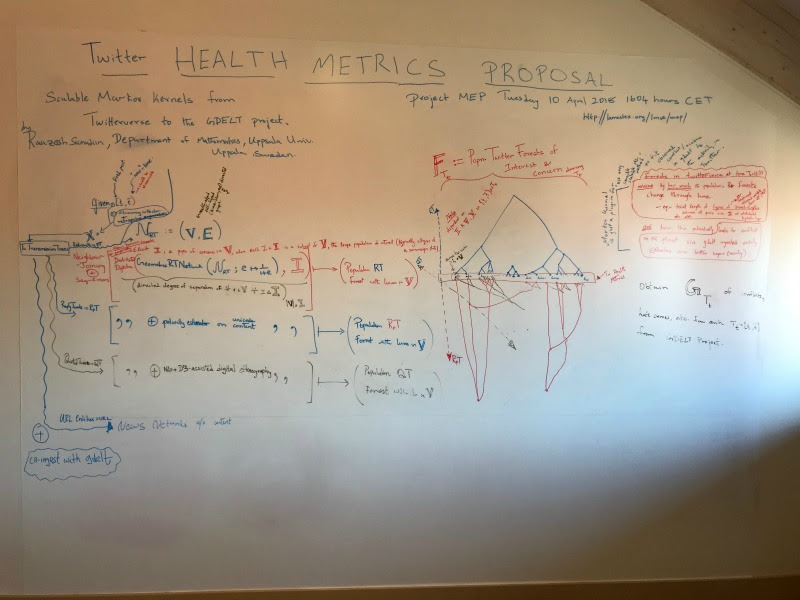

# Scalable Markov Kernels from Twitterverse to the GDELT Project

THE VISION: Twitter Poputation forests are a scalably computable
summary statistic of the status updates within a population of interest
and/or concern. Many current notions and observed phenomenon in the
literature, including certain definitions of homophily, self-segregation
due to ascertainment bias, etc., can be captured to various extents
using various further statistics of the population forests, which are
themselves a natural and intuitive summary statistic of the status
updates modelled via finite Markov information exchange process. We 
propose to use such population forests as a highly
responsive and customizable health metric by using appropriate Markov
kernels (to estimate and test) into the measurable spaces provided by
the [GDELT](https://www.google.com/url?q=https://www.gdeltproject.org/&sa=D&ust=1523612488646000) project
for a grounding in reality.

### Population Twitter Forests of Interest and Concern

THE FORM:

### Name of Point of Contact
Raazesh Sainudiin

### Name of Organization
Department of Mathematics, Uppsala University, Sweden.        

### Propose and define a health metric that Twitter could use to measure itself.

Given a population of interest V with subpopulations of
concern C, our health metric will be derived from population ideological 
forests that summarize status updates
over V. Forest-based statistics will be developed by A/B testing against
events of concern in GDELT news streams.

### How would Twitter capture, measure & evaluate this health metric?

Population ideological forests (PIFs) are Pregel-programmable
summary of three types of status updates within V, that are modelled as
finite Markov information exchange processes with map-reducible
nonparametric estimates. Conversational health in V is captured by
statistics of PIFs, such as, inter-clade sentiment disequilibrium,
coloured branch lengths, rate of growth of clades of concern. PIFs
metric can be evaluated against events in the GDELT project, and each
user can benefit from “where am I?” operator by viewing their leaf node
in their own PIFs.

### What funding would the proposal require (\$USD)?

543,393 USD

The total funding required is of 543,393 USD. The
budget would cover 80% of the salary for five years (with Dept of Maths
at Uppsala covering the remaining 20%) of a specific highly skilled PhD
student (Ivan Sadikov) who has the mathematical and data engineering
skills needed to help meet the deliverables (324,506 USD), 20% of the
salary for Raazesh Sainudiin for five years (168,888 USD), and minimal
cloud computing costs for AWS underneath the already available
databricks professional shard, conference travel and  open access
publication fees (10,000 USD / year).

## What would be the output of the proposal and timeline?

-   (A) Apache 2.0 Licensed library with sbt builds
    that will extend from Project MEP: [https://github.com/lamastex/scalable-data-science/tree/master/meme-evolution](https://www.google.com/url?q=https://github.com/lamastex/scalable-data-science/tree/master/meme-evolution&sa=D&ust=1523612488650000){.c2}

<!-- -->

-   (1) Year 1 and 2: Apache Spark Scala/Java modules
    for:

<!-- -->

-   (i) interactive and iterative experimental design using D3
    over free databricks community edition via Streaming+REST Twitter
    free APIs for independent researchers in investigative journalism
    and digital humanities (specifically at Uppsala’s Centre for
    Multidisciplinary Studies in Racism) by extending
    from Spark-Streaming module [http://lamastex.org/lmse/mep/src/extendedTwitterUtils.html](http://lamastex.org/lmse/mep/src/extendedTwitterUtils.html) and
     SparkSQL module [http://lamastex.org/lmse/mep/src/TweetAnatomyAndTransmissionTree.html](http://lamastex.org/lmse/mep/src/TweetAnatomyAndTransmissionTree.html). 
-   (ii) Geometric retweet network and shortest
    weighted directed paths to obtain retweet degrees of separation from
    subpopulations of concern using Apache Spark’s core and GraphX/Frame
    library by extending from [http://lamastex.org/lmse/mep/src/GraphXShortestWeightedPaths.html](http://lamastex.org/lmse/mep/src/GraphXShortestWeightedPaths.html)
-   (iii) Population retweet (ideological) forests by a
    sequential k-means based neighbour-joining tree building strategy
    (needs more experiments and theory ).
-   (iv) Make pipelines for scalable ETL of GDELT data
    available in GDELT-ETL module (plan: dynamically ingest needed dates
    from GDELT into AWS s3 or local bare-metal hdfs, experiment with
    appropriate tools in Hadoop ecosystem: accumulo, elastic search,
    web-scrape new articles using Scala Goose using Spark’s
    mapPartitionBy operator, etc.).
-   (v) Module to evaluate retweet forest health metric of the US
    2016 election data against GDELT-events or US Southern Poverty Law
    Centre (SPLC) Hate Maps (even-type and counts)

<!-- -->

-   (2) Year 2 and 3:

<!-- -->

-   (i) Scala Spark module to scalably obtain
    “news/information” networks from the ‘URL entities’ in status
    updates and superimposing this network over the standard twitter
    networks of users (the web-scraped content of these news networks is
    needed for the context to understand reply and quoted tweets).
    
-   (ii) Scala Spark module to scalably estimate the
    mathematical model (appropriate finite Markov information exchange
    process for reply tweets and quoted tweets) 
-   (iii) Forest health metrics, refinement, A/B
    testing and evaluation suite against 

<!-- -->

-   (a) GDELT extracted entities for event types and
    counts (check against the forests with US Hate Groups and SPLC
    Hate Map)
-   (b) GDELT extracted sentiments and
    Spark/Stanford-NLP extracted sentiments and concepts from
    web-scraped news content pointed by URL entities in the status
    updates of concern/interest

<!-- -->

-   (3) Year 3 and 4: Same as (1) and (2) but for Reply
    tweets and Quoted tweets with URL entities networks providing
    context
-   (4) Year 5: Modules for introspection
    with the “Where Am I Operator?”

<!-- -->

-   (B) Peer-reviewed Publications (some of these are
    jointly with the Canterbury team)

<!-- -->

-   (1) Year 1 and 2:

<!-- -->

-   One peer-reviewed publication in a Mathematical
    Statistical Journal on Retweet Ideological Forests
-   Presentation of pipeline from experimental design to
    population retweet ideological forest at one general Conference
    
-   Conference Proceeding about retweet forest health
    metric validated against GDELT/SPLC-HateMap (even-type
    and counts)

<!-- -->

-   (2) Year 2-4: Mathematical Statistical Paper on the
    theory (finite Markov information exchange model, non parametric
    estimate and interpretable forest summary) for other types of
    Ideological Forests (Reply and Quoted) with Context URL-entities
    networks
-   (3) Year 3: Conference proceeding / paper about
    forest and direct network-based health metrics for retweets, reply
    tweets and quoted tweets (jointly with Canterbury team)
-   (4) Year 4: Conference proceeding / paper about
    novel scalable distributed learning algorithms from ProjectMEP to a
    more general distributed computing and big data audience
-   (5) Year 5: Peer-reviewed paper in social/political science
    journal about the “where am I?” operator and exercising democracy in
    social media (jointly with
    Canterbury team).

- Link to relevant papers you've published (link \#1)
  * [http://lamastex.org/preprints/2017HateIn2016USAElection.pdf](http://lamastex.org/preprints/2017HateIn2016USAElection.pdf)
- Link to relevant publications (link \#2)
  * [http://dx.doi.org/10.1016/j.jtbi.2016.07.038](http://dx.doi.org/10.1016/j.jtbi.2016.07.038)
- Link to relevant publications (link \#3)
  * [https://lamastex.gitbooks.io/sds-2-2/content/](https://lamastex.gitbooks.io/sds-2-2/content/)

## Additional Comments

This proposal is done jointly with the proposal made by Giulio
Valentino Dalla Riva based at the Department of Statistics, University
of Canterbury, New Zealand in collaboration with Università di Venezia
(Walter Quattrociocchi), Venice, Italy. Both
proposals plan to build on each others’ progress with some joint
deliverables from years 2-5. 

**More detailed version:** Suppose we have a population
of interest (say twitter accounts that are communicating with the
parliamentary members of a democratic nation state or their most
influential accounts) denoted by V that contains a set of populations of
concern C, such that each c in C is a subset of V. We can observe the
status updates of accounts in V that are rather rich in information. By
using specific models in the class of  Aldous’ Finite Markov Information
Exchange or FMIE processes (Aldous, D., 2013. Bernoulli), a rather rich
and tractable class of models for stochastic social dynamics, we can
simplify the communications in the network with mathematical clarity.
Then we can use a natural representation of an empirical estimate of the
model from the data via a population forest made up of a set of
mathematical trees whose leaf nodes are user accounts in V and whose
branch lengths between leaf nodes represent a projection of the pairwise
distance that encodes a mathematically precise relationship between
these accounts in twitter (these details vary depending on the tweet
type, the FMIE process model and its nonparametric estimate, and what
exactly in the estimate is being summarized by the forest). We have just
finished such a mathematical statistical pipeline (only for retweets
using one of the simplest FMIE processes) with fully scalable
implementation in Apache Spark in our Working Paper on
[HateIn2016USElection](http://lamastex.org/preprints/2017HateIn2016USAElection.pdf) at 
[http://lamastex.org/preprints/2017HateIn2016USAElection.pdf](https://www.google.com/url?q=http://lamastex.org/preprints/2017HateIn2016USAElection.pdf&sa=D&ust=1523612488655000) 
and this proposal aims to extend it to multiple tweet types,
incorporate natural language processing components and validate the
forest-based health metrics against the GDELT project of real-world
events. We use our existing pipeline for retweet networks to give a
concrete presentation on how to capture, measure and evaluate in the
simplest setting instead of diving into the details for each tweet type,
model, estimate and forest extractor.

### Capture: 
There are several experimental design
considerations for V and C. The elements of C
are typically informed by domain expertise (for example, the
classification of “extremist ideologies” and its most charismatic
proponents by the US-based Southern Poverty Law Center or the
Sweden-based Uppsala University’s Centre for Multi-disciplinary Studies
in Racism or CEMFOR depending on V). More generally V and C can also be
empirically generated using trending topics filtered for events of
concern with out without domain expertise on populations of concern.
Note that the two approaches above to design are not mutually exclusive.
When we have a past event of interest, say a given conflict (with domain
expertise at CEMFOR), then the design can be based on finding the
appropriate sub-network of the Twitterverse in the past.

We have some experience in iterative experimental design during
our research around the US 2016 election where we limited ourselves to
freely available Twitter data. Our proposed projects will build on these
scalable ML pipelines in Apache Spark’s ML, Streaming and GraphX
libraries which can already extract one type of forest (for original
tweets and retweets). This experimental design patterns allow the use of
Twitter’s streaming and REST APIs via 
[extendedTwitterUtils.html](http://lamastex.org/lmse/mep/src/extendedTwitterUtils.html) (as
in Materials & Methods of
HateIn2016USElection) to obtain a set of
status updates related to V over a time interval T = \[t\_s, t\_e\] via
the SparkSQL module 
[TweetAnatomyAndTransmissionTree](http://lamastex.org/lmse/mep/src/TweetAnatomyAndTransmissionTree.html). 

### Measure: 

This project will focus on original-tweets, retweets, reply-tweets
and quoted-tweets that are already output transparently from the last
SparkSQL module. For simplicity here, let’s focus on the first two types
of tweets, i.e. let’s filter the status updates in T by original-tweets
and retweets and represent this as directed multi-edged self-looped
tweet-retweet network or simply retweet network where each directed edge
is from a tweeter to a retweeter (the nodes representing twitter
accounts and edges have other attributes of interest in the sequel). The
multi-edged retweet network can be represented as a weighted
single-edged geometric retweet network where the weights are given by
1/(1+ number of retweets) with a natural Poisson process interpretation
(see Geometric Retweet Network in [HateIn2016USElection](https://www.google.com/url?q=https://tinyurl.com/ycz674kx&sa=D&ust=1523612488657000)).
Using the Pregel model of bulk-synchronous parallel vertex programming
in Spark’s GraphFrame library, one can obtain single source shortest
paths from each element of the population of concern C to each user in
the population of interest V, and thus summarizing each user by an array
of the shortest geometrically weighted path lengths (or the most
retweeted path lengths) to the populations of concern in C. Finally
using scalable variants of the Neighbor-joining algorithms once can go
from all pairwise Manhattan distances of such path lengths to a retweet
population forest (using sequential k-means clustering to ameliorate the
quadratic costs as prototyped successfully by my MSc student Joakim
Johansson). The most populous tree of such a forest is shown in Table 4
of 
[HateIn2016USElection](https://www.google.com/url?q=https://tinyurl.com/ycz674kx&sa=D&ust=1523612488657000)
for a politically active population of interest during the
US 2016 election where the population of concern C is defined by the US
Southern Poverty Law Centre.  Clearly, this forest, whose leaves are
user accounts and whose clades are subsets of users who have a similar
array of shortest path lengths along the most retweeted paths from each
element in C, captures who is most/least similarly influenced by
elements in C and can be seen as an explicit way of understanding
various phenomenon relating to conversational health occurring in V
given C (for eg., there may be just two bushy clades that are connected
by a long branch-length if there are two highly connected communities
with very little retweets across them and with two different subsets of
C influencing each of the two different community, say). In the proposed
research each of the three main types of tweets (other than retweets,
with additional natural language processors, operators and estimators
such a sentiment-polarity extractors for reply and quoted tweets and
more sophisticated Poisson processes like the co-excitatory Hawkes
process for instance) will yield its own forest, and all three types of
forest can be co-represented by simply identifying their leaf nodes or
user accounts in V. As the interval of time T changes as a moving
window, implementable via Apache Spark structured streams for instance,
the three forest types will naturally become dynamic. These dynamic
forests are themselves our proposed primary health metric.

Various statistics of these forests, depending on the
forest-type, such as inter-clade structure and branch lengths, size and
rate of growth of clades that are most influenced by populations of
concern, etc., form a host of natural univariate health metrics of these
dynamic forests. 

### Evaluate: 
To interactively explore, improve, calibrate and evaluate these
population forest health metrics (or those metric proposed in the
companion proposals) with a grounding in
reality, the second major phase of the proposed project
will be about co-ingestion of [GDELT](https://www.gdeltproject.org/) streams.
Correlations between the forest-based metrics and the rich set of
pre-extracted GDELT entities such as people, locations, organizations,
themes, sources, emotions, counts and events can be first explored in
ethnographically and journalistically well-characterized recent events
involving our populations of interest and concern. The GDELT entities
stream can be further augmented with (i) ethnographic domain expertise,
such as field studies on ongoing ethnic and racial conflicts in various
parts of the world by researchers based at Uppsala’s Centre for
Multi-disciplinary Studies in Racism, and (ii) computational approaches
such as web-scraping of the news-source URLs (for eg., to improve on
GDELT extractors of statistics such as the number of deaths due to
hate-crime of a certain type in the US by calibrating against the
[Hate Watch](https://www.splcenter.org/hatewatch) data,
and apply the improved extractors to other contexts with poorer direct
statistics of health in the real world). 

